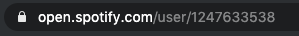
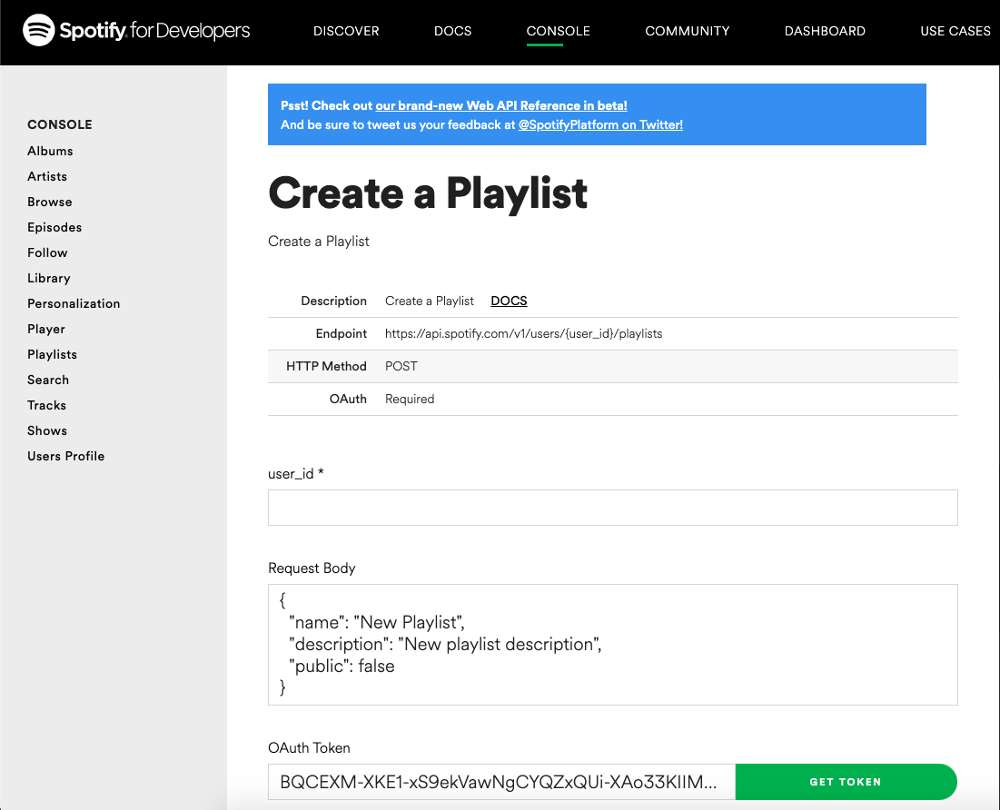
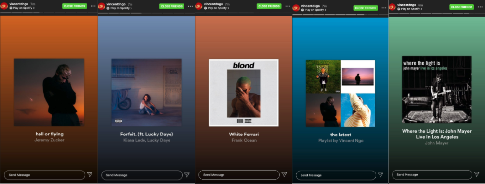
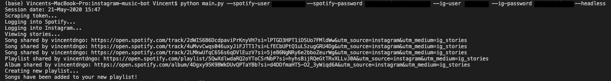
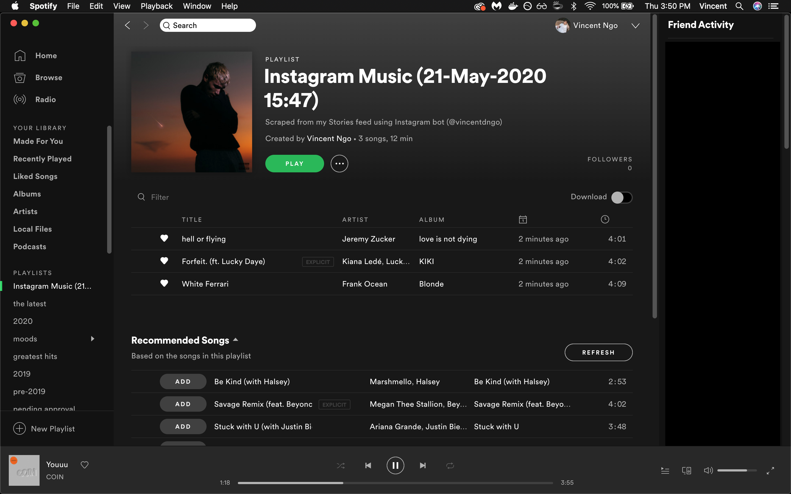

# Instagram Music Bot
A bot that will find music shared in Instagram Stories by users you follow, provide links to these songs, and add them to a custom Spotify playlist. Able to be run in the background and scheduled to run daily. Works with Google Chrome.

### Built With:
* [Selenium Webdriver]
* [Spotify Web API]
* [Requests Library v 2.23.0]

### Local Setup
1) Install dependencies
`pip install -r requirements.txt`

2) Run script with available arguments

   * Required arguments:
      * `--spotify-user`: Spotify user ID
         * To find your Spotify User ID, search for your own profile on Spotify web player, and it should be in the url

            
           
      * `--spotify-password`: Spotify password
      
      * `--ig-user`: Instagram username
      
      * `--ig-password`: Instagram password
   * Optional arguments
      * `--headless`: Enable script to run silently in the background (RECOMMENDED)
      
      * `--schedule`: Schedule script to run once daily at the time you specify
         * Specify time in military time, e.g. `01:30` or `13:30`
         * If the bot is currently scheduled, you can always stop it by pressing `Ctrl-C`
         * If you want to run the script independently without disturbing the current schedule, simply open a new terminal and run the script there

Example: `python main.py --spotify-user YOUR_USER_ID --spotify-password YOUR_PASSWORD --ig-user YOUR_USERNAME --ig-password YOUR_PASSWORD --headless --schedule 12:00`

### What it does
* Scrapes Spotify OAuth token
   
* Logs into Instagram and Spotify with your accounts
* Views the unread Stories of the users you follow (< 1 sec. per Stories post)
* Checks if someone shared a Spotify track, album, playlist, artist, podcast, or podcast episode on their story
   
* If so, displays Spotify web player links to those media and the users who shared them
   
* Once the bot is finished viewing stories, it generates a new custom “Instagram Music” playlist and adds all shared tracks 
   

### To Do
* Tests
* More error handling

  [Selenium Webdriver]: <https://www.selenium.dev/documentation/en/webdriver/>
  [Spotify Web API]: <https://developer.spotify.com/documentation/web-api/>
  [Requests Library v 2.23.0]: <https://requests.readthedocs.io/en/master/>
